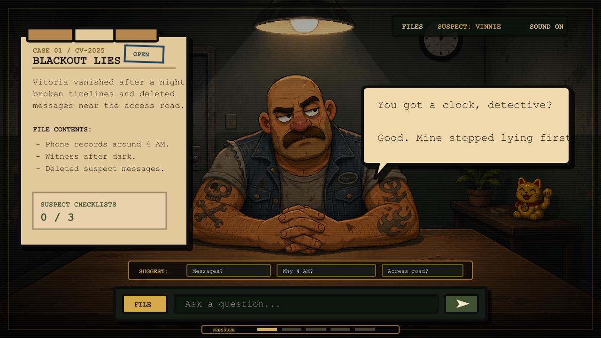

# Blackout Lies

[](https://nextjs.org/)
[](https://react.dev/)
[](https://www.typescriptlang.org/)
[](https://tailwindcss.com/)
[](LICENSE)

Blackout Lies is a noir pixel art interrogation game built with Next.js and TypeScript. Players move through a fictional case file, question suspects, pressure contradictions, and piece together a broken timeline one answer at a time.



## Discoverability

Blackout Lies is useful for developers and game makers exploring AI-assisted narrative games, local-first game logic, LLM-backed NPC dialogue, and browser-based detective games.

Suggested GitHub topics:

`noir-game`, `pixel-art`, `detective-game`, `interrogation-game`, `mystery-game`, `narrative-game`, `interactive-fiction`, `browser-game`, `web-game`, `ai-game`, `openai`, `llm`, `nextjs`, `react`, `typescript`, `tailwindcss`, `zustand`, `framer-motion`, `threejs`, `itchio`

Search phrases:

- Noir pixel art interrogation game
- Detective browser game built with Next.js
- AI-assisted narrative game with local fallback
- OpenAI-powered suspect dialogue demo
- TypeScript mystery game with contradiction tracking

## Why This Project Exists

Blackout Lies explores how an interrogation game can combine:

- Free-form detective questions
- Character-specific lies, secrets, and pressure points
- A local rules engine that works offline
- Optional LLM-backed suspect responses through a server route
- A responsive noir pixel art interface

The case content is fictionalized and designed for gameplay. Avoid presenting in-game outcomes as real-world legal conclusions.

## Features

- Playable case menu with locked and open case folders
- Three suspects with profiles, secrets, contradictions, and confession checklists
- Free-form interrogation input
- Suggested questions for each suspect
- Case file tabs for case context, history, notes, and checklist progress
- Pressure bar and topic-based progression
- Local fallback engine for offline play
- Optional OpenAI provider handled on the server
- Browser audio feedback with volume and mute controls
- Responsive noir pixel art UI

## Tech Stack

- Next.js 16
- React 19
- TypeScript
- Tailwind CSS
- Framer Motion
- Lucide React
- Zustand
- Three.js
- Browser Audio API

## Quick Start

```bash
npm install
npm run dev
```

Open `http://localhost:3000`.

The game works without API credentials. When no LLM provider is configured, it uses the local interrogation engine.

## Available Scripts

```bash
npm run dev
npm run typecheck
npm run build
npm run lint
```

## LLM Configuration

The default mode is local/offline. To enable OpenAI responses, copy `.env.example` to `.env.local` and fill in your own key:

```bash
LLM_PROVIDER=openai
OPENAI_API_KEY=sk-proj-your-key
OPENAI_MODEL=gpt-5.4-mini
OPENAI_BASE_URL=https://api.openai.com/v1
```

Security notes:

- Never commit `.env.local`.
- Never commit API keys.
- The browser never receives the API key.
- Requests go through `src/app/api/interrogate/route.ts`.
- If `LLM_PROVIDER` is not `openai` or `OPENAI_API_KEY` is missing, the game falls back to local mode.

## How The Game Works

1. The player selects a case folder.
2. The game loads the suspects assigned to that case.
3. The player asks a free-form question.
4. The server route chooses either the local engine or the configured LLM provider.
5. The answer updates the dialogue history, pressure, notes, and checklist progress.
6. A suspect can only close their file when required confession points are discovered.

## Project Structure

```txt
src/
  app/
    api/interrogate/route.ts     Server entry point for suspect answers
    globals.css                  Noir pixel art UI styles
    layout.tsx
    page.tsx
  audio/
    AudioManager.ts
    sfx.ts
  components/game/
    CaseFilePanel.tsx
    CaseMenuScreen.tsx
    GameScreen.tsx
    GameShell.tsx
    InputBar.tsx
    PressureBar.tsx
    SpeechBubble.tsx
    SuspectSelector.tsx
  game/
    engine/
      interrogationEngine.ts     Local interrogation rules and progression
      interrogationServer.ts     Provider selection for server responses
    prompts/
      buildSuspectPrompt.ts
      promptTemplates.ts
    suspects/
      cases.ts
      index.ts
      baby.ts
      nico-grin-moretti.ts
      rosa-black-cat-neri.ts
    types/
      case.ts
      dialogue.ts
      suspect.ts
public/
  assets/
    screenshots/
    start/
    suspects/
    music/
```

## Architecture Rules

- Keep components modular.
- Use TypeScript types from `src/game/types/`.
- Keep suspect and case content in `src/game/suspects/`.
- Keep interrogation logic in `src/game/engine/interrogationEngine.ts`.
- Keep prompt construction in `src/game/prompts/`.
- Do not hardcode large game state inside React components.
- Do not add external services unless the project explicitly needs them.
- Maintain the noir pixel art interrogation UI style.

## Contributing

Contributions are welcome. Good first contributions include bug fixes, accessibility improvements, responsive UI polish, new test coverage, clearer documentation, and small content improvements that respect the existing case structure.

Before opening a pull request:

1. Create a focused branch.
2. Keep changes scoped to one feature or fix.
3. Run `npm run typecheck`.
4. Run `npm run build` when changing app behavior or build configuration.
5. Add screenshots or notes for visible UI changes.
6. Explain what changed and why in the PR description.

## Adding A New Suspect

1. Create a file in `src/game/suspects/new-suspect.ts`.
2. Define the suspect profile, case context, private knowledge, interrogation rules, suggested questions, confession checklist, and voice.
3. Export the suspect from `src/game/suspects/index.ts`.
4. Add the suspect to the relevant case in `src/game/suspects/cases.ts`.
5. Add assets in `public/assets/suspects/new-suspect/`.
6. Validate the local engine and `/api/interrogate` flow.

## Adding A New Case

1. Add a case folder in `src/game/suspects/cases.ts`.
2. Assign one or more suspect IDs.
3. Keep case evidence short, readable, and useful during interrogation.
4. Add or reuse suspect assets in `public/assets/suspects/`.
5. Test the case menu, suspect switching, checklist progress, and return-to-files flow.

## Content Guidelines

- Keep writing concise, noir, and playable.
- Make each suspect hide information in a different way.
- Prefer clues that lead to questions instead of lore dumps.
- Do not reveal core secrets from generic questions.
- Keep fictionalized case material clearly framed as game content.

## Troubleshooting

- `npm run dev` fails immediately: run `npm install` again and check your Node.js version.
- OpenAI responses do not appear: confirm `LLM_PROVIDER=openai`, `OPENAI_API_KEY`, and server logs.
- The game loads without audio: browsers may block audio before the first user interaction.
- A suspect gives no useful answer: verify their `interrogationRules`, `sensitiveTopics`, and checklist matchers.

## License

Blackout Lies is released under the MIT License. See [LICENSE](LICENSE).
